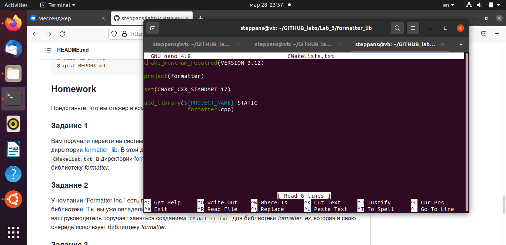
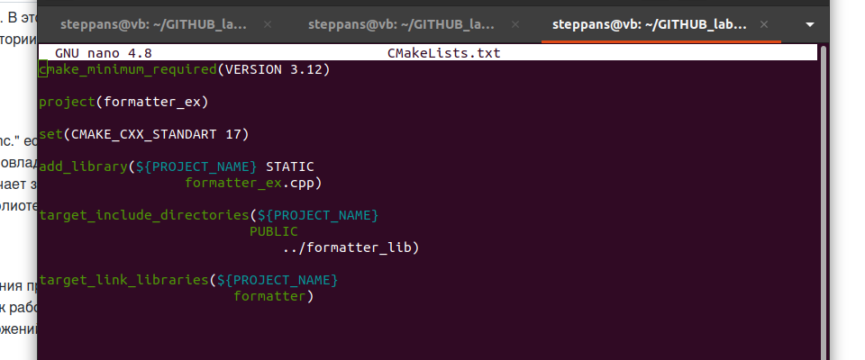
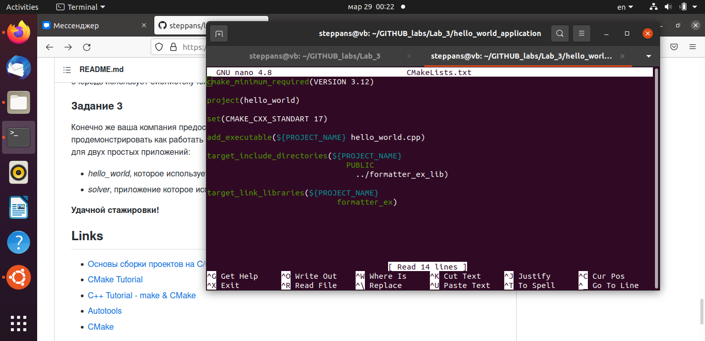
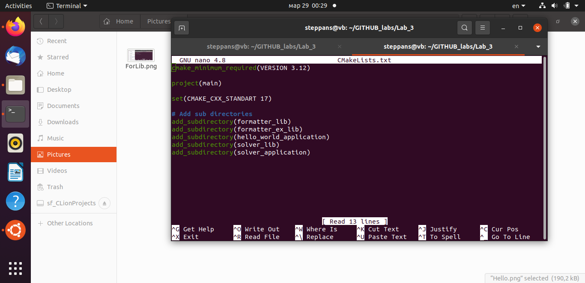
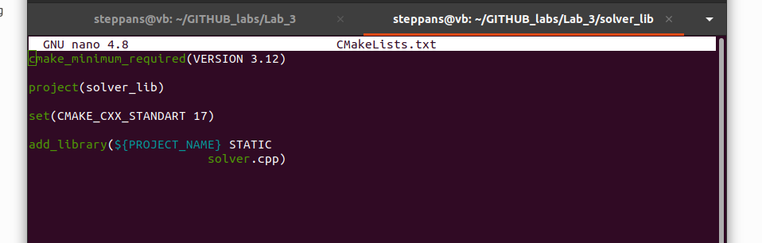
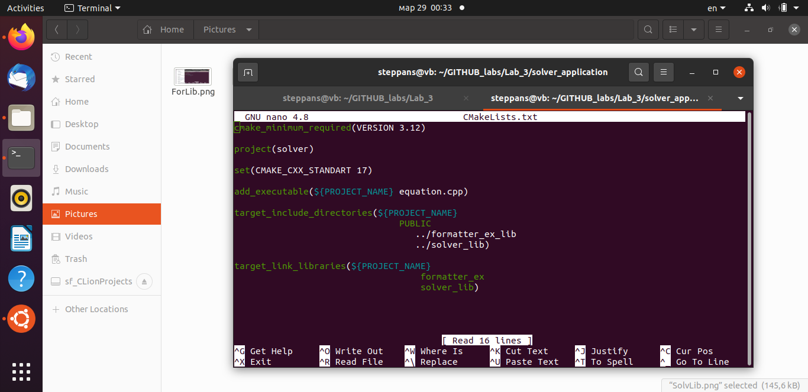
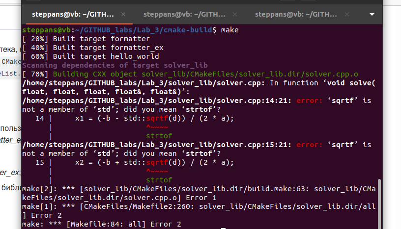
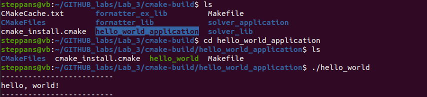
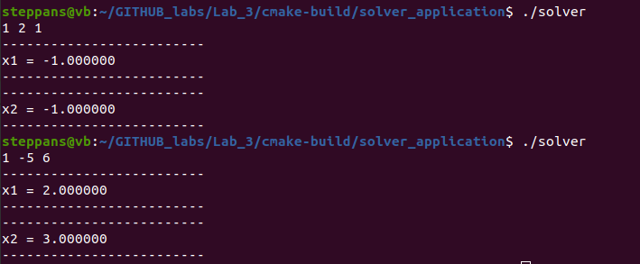

#Laboratory work 3
## Task I
 - In directory `formatter_lib` I created such `CMakeLists.txt`:

 - `cmake_minimum_required` set minimal version of cmake tools.
 - `project' set the name of build.
 - `set` require minimal standart of `g++` compiler.
Command `add_library` add in build of project block of files, which will be used like library of all functions, determined in these files.
So, *static library* is created.
## Task II
 - In directory `formatter_lib` I created another `CMakeLists.txt` file:
 
 - By `target_include_directories` I include directory of formatter_lib to contact with header file formatter.h
 - By `target_link_libraries` I connect with library, where functions from header are defined.
So, another *static library* is created.
## Task III
 `CMakeLists.txt` in *hello_world_application*:

 - **When I include library and directory for only *formatter_ex_lib* I also contact with *formatter_lib*, as in CMake file in *formatter_ex_lib* directory of *formatter_lib* hasmodifier `PUBLIC`**.
 But I couldn't make this file, because projects are divided on different directories.
 So, I need to creat new CMake file in main directory:

 Then I do similar files in `solver_lib` and `solver_application`:

 And whole assemly I run in directory `cmake-build` in main directory.

 And I get a mistake...
 So, I added in solver.cpp header `<cmath>` and change `sqrtf` simply on `sqrt`.
 Then all file were assemled, and in directories `hello_world_application` and `solver_application` in directory `cmake-build` I got two executable file and run them.

 And applications ran!!!  
